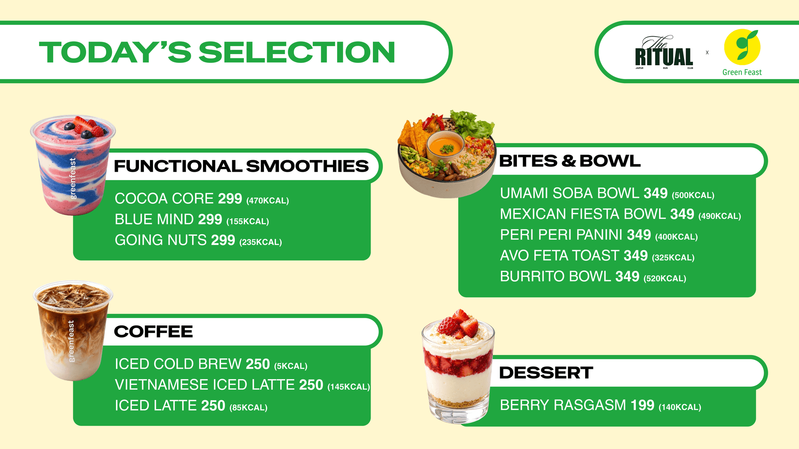

# Event Screens Plan — The Ritual × Green Feast

**Branch:** `event/ritual-x-greenfeast`
**Status:** planned, nothing built. No code files touched yet.
**Written:** 2026-09-12

A temporary takeover of **two** of the three live boards for a Ritual (Jaipur Run Club)
collaboration event. The boards themselves are not modified — two new standalone pages are
added, and the two TVs are pointed at them for the duration of the event.

| New page | Replaces | Shows |
|---|---|---|
| `rmain.html` | Screen 1 — Bowls (`bowls.html`) | The Ritual × Green Feast logo lockup |
| `rmenu.html` | Screen 3 — Beverages (`beverages.html`) | "Today's Selection" event menu |

Screen 2 (Wraps, Paninis & Open Toasts) is **untouched** and keeps running the normal menu
throughout. Screen 4 does not exist yet.

⚠️ The names are not self-evident and will not be in six months: **`rmain` is the bowls
screen** (it carries the branding, so it's the "main" wall) and **`rmenu` is the beverages
screen** (it carries the menu). Owner's naming, kept as given.

---

## 1. Why this approach

An already-open kiosk tab **never re-fetches its own HTML**. Editing `bowls.html` or
`beverages.html` and pushing therefore changes nothing on the wall until somebody
hard-refreshes that TV. Since the TV has to be visited either way, the cheapest and safest
move is to visit it *once* and change the URL — not to modify the live boards at all.

What this buys:

- **Nothing shared is touched.** No `core.css`, no `core.js`, no `<screen>.css`, no
  `<screen>.js`, no `data/*.json`, no Sheet tab.
- **Therefore no `?v=N` bump**, and **no hard refresh needed on Screen 2.** The one deploy
  rule that can silently break the store (see CLAUDE.md "Go live") does not apply here,
  because no file any running board has cached is being changed.
- **The real boards survive intact.** Revert is a shortcut swap, not a code rollback. If
  the event pages are wrong, the worst case is two screens showing a bad poster while the
  menu data underneath is untouched and correct.

The alternative (a config-JSON-driven takeover overlay inside the boards themselves) was
considered and rejected for this event: it edits `core.js`/`core.css`, which forces a `?v=`
bump and a manual hard refresh on **all three** TVs before it works even once — more
physical touching than this needs, for a one-off. Revisit it only if these events become
routine.

---

## 2. Files to add

```
rmain.html                    new — Screen 1 TV, event mode
rmenu.html                    new — Screen 3 TV, event mode
images/events/rmain.png       new — 1920×1080 logo lockup
images/events/rmenu.png       new — 1920×1080 "Today's Selection"
build-event-art.mjs           new — offline sharp script, source art → 1920×1080
EVENT-SCREENS-PLAN.md         this file
```

`.gitignore` already permits these: the PNG ignore rules are **root-anchored** (`/*.png`),
so `images/events/*.png` commits normally. No `.gitignore` change needed.

`build-event-art.mjs` is optional but recommended — the artwork will very likely be revised
before the event (see §8), and a script means the resize/flatten is repeatable and matches
how `build-screen2-cutouts.mjs` and `build-screen3-cutouts.mjs` already work. It is offline
tooling, never loaded by the live site.

---

## 3. Page markup (proposed, both pages identical apart from two values)

Deliberately dependency-free: no `core.css`, no `core.js`, no Google Fonts, **no JavaScript
at all**. The page is one image; anything more is a liability on a screen that has to run
unattended for a day.

```html
<!DOCTYPE html>
<html lang="en">
<head>
  <meta charset="UTF-8">
  <meta name="viewport" content="width=device-width, initial-scale=1, maximum-scale=1, user-scalable=no">
  <title>Green Feast × The Ritual — Today's Selection</title>
  <style>
    html, body {
      margin: 0; padding: 0; height: 100%;
      background: #FFF7CF;      /* the artwork's own ground — see below */
      overflow: hidden;         /* no scrollbar on a display-only screen */
      cursor: none;             /* in case a mouse is plugged into the TV */
    }
    .event-art {
      position: fixed;
      top: 0; right: 0; bottom: 0; left: 0;   /* NOT `inset` — Chrome 87, DP §9 */
      width: 100%; height: 100%;
      object-fit: contain;                     /* Chrome 32, safe */
      display: block;
    }
  </style>
</head>
<body>
  
</body>
</html>
```

Per-page values:

| | `rmenu.html` | `rmain.html` |
|---|---|---|
| `<title>` | Green Feast × The Ritual — Today's Selection | Green Feast × The Ritual |
| `background` | `#FFF7CF` (sampled from the artwork) | pale sage — **to be sampled from the real file** |
| `src` | `images/events/rmenu.png` | `images/events/rmain.png` |

**Chrome 69 compliance** (DP §9): `top/right/bottom/left` instead of `inset`; `object-fit`
is Chrome 32+; no flex, so no flex-`gap` trap; no JS, so no silent-syntax-error class of
failure at all.

**`contain`, not `cover`.** Both artworks are exactly 16:9, so on a 1920×1080 panel there
are no bars either way. `contain` is chosen for the case where the panel isn't exactly
16:9 or an address bar eats a strip — it letterboxes rather than cropping, and event
artwork has text close to its edges that `cover` would slice off. The `background` colour
makes any such bar the artwork's own ground instead of black.

---

## 4. Artwork pipeline

**`rmenu`** — source located: `C:\Users\hp\Downloads\RitualxGF screen menu.png`
- 8000×4500, PNG, **has an alpha channel**, 3.6 MB. Exactly 16:9. ✓
- Ground colour sampled at four points: `#FFF7CF` (consistent).
- Process: flatten alpha onto `#FFF7CF` → resize to 1920×1080 → PNG.
  Flattening matters: any transparent pixel left in the file renders **black** on the TV.
- Output size measured: **~190 KB** as a palette PNG, vs ~296 KB as JPEG q92. PNG is both
  smaller *and* cleaner here — the artwork is flat colour with crisp white-on-green text,
  exactly the case where JPEG rings visibly around letter edges.

**`rmain`** — **source file not yet available.** The lockup was pasted into chat, which
doesn't put a file on disk, and nothing matching it is in `Downloads/` or the repo. Needed
before this page can be built (see §8).

**Legibility check — measured, passes.** Text heights on the `rmenu` artwork scaled to
1920×1080, against the live boards' typography tokens in `core.css`:

| Element | Cap height @1920 | ≈ font-size | Live board token | Verdict |
|---|---|---|---|---|
| "TODAY'S SELECTION" | 72px | ~100px | — | far above anything on the boards |
| Section headings | 38px | ~53px | `--fs-section-title: 38px` | larger ✓ |
| Item names | 26px | ~36px | `--fs-item-name: 24px` | larger ✓ |
| kcal parentheticals | 15px | ~21px | `--fs-item-desc: 18px` | larger ✓ |

The smallest text on the poster (the kcal parentheticals) still sits above the boards'
Item Desc token, so nothing on it reads smaller than what already works on the wall.

---

## 5. Cutover at the store

Kiosk mode disables the address bar, so you cannot navigate the running tab — the reliable
path is **close the window and relaunch from a shortcut**. Prepare four desktop shortcuts,
two per affected TV, so the owner never types a URL:

**Screen 1 TV (bowls)**
```
chrome.exe --kiosk https://jsamarth729-cell.github.io/green-feast-menu/rmain.html
```
```
chrome.exe --kiosk https://jsamarth729-cell.github.io/green-feast-menu/bowls.html
```

**Screen 3 TV (beverages)**
```
chrome.exe --kiosk https://jsamarth729-cell.github.io/green-feast-menu/rmenu.html
```
```
chrome.exe --kiosk https://jsamarth729-cell.github.io/green-feast-menu/beverages.html
```

Label them plainly — "EVENT screen" / "NORMAL menu" — and put both on each TV's desktop.

Sequence on the day:
1. **Pre-warm, the day before.** Open each event URL once on its TV, confirm it paints,
   then close. The image lands in Chrome's cache, so the real cutover has no blank moment
   on store wifi.
2. At cutover: `Alt+F4` to close the kiosk window, double-click **EVENT screen**.
3. After the event: `Alt+F4`, double-click **NORMAL menu**.

**Screen 2 is not touched at any point.** Do not close or refresh it.

---

## 6. Revert

There is nothing to roll back in code — the boards were never modified. Revert is step 3
above, per TV.

The two pages and their images should **stay on `main` permanently** after the event. They
cost nothing, are referenced by nothing, and make the next collaboration a matter of
dropping in new artwork rather than rebuilding this.

---

## 7. Decisions and their tradeoffs

- **No JavaScript, so no fullscreen-on-gesture.** The boards carry
  `initFullscreenTrigger()` from `core.js` because some TV browsers show an address bar.
  These pages don't, on the assumption the TVs genuinely launch with `--kiosk` (already
  fullscreen). If an address bar does appear, `F11` once fixes it — and because the layout
  is `object-fit: contain`, a stolen strip letterboxes harmlessly instead of breaking.
  Loading `core.js` just for that one function was rejected: it would re-couple these pages
  to the `?v=N` versioning discipline this whole approach exists to avoid.
- **No auto-refresh.** A `<meta http-equiv="refresh">` would let revised artwork reach the
  TV without a store visit, but it repaints the whole page on a fixed cycle — a visible
  flash every few minutes on a display-only screen reads as a fault. Consequence:
  **artwork must be final before cutover**; a later revision needs a hard refresh at the
  TV. Acceptable because somebody is at the TV at the start of the event anyway.
- **PNG over JPEG** — see §4; measured smaller *and* sharper for this kind of artwork.
- **Pages named as the owner named them** (`rmain`/`rmenu`) rather than something
  self-describing like `event-bowls.html`. Mapping recorded at the top of this file.

---

## 8. Open items — needed before building

1. **The `rmain` logo-lockup artwork file.** Not on disk anywhere. Drop it in `Downloads/`
   (or anywhere and tell me the path) — ideally the original export, 16:9, ≥1920 wide. Its
   ground colour will be sampled from the file rather than guessed.
2. **Event date and duration**, so the pre-warm step in §5 can be scheduled.
3. **Confirm the TVs really launch via `--kiosk`** — decides whether the `F11` note in §7
   matters in practice.
4. **Three content discrepancies between the `rmenu` artwork and the menu data.** Checked
   against the local snapshot CSVs (`data/*-sheet.csv`), **not** the live Sheet, so verify
   against the Sheet before treating any of these as real:

   | Item | Event artwork | Board data | Why it matters |
   |---|---|---|---|
   | Avo Feta Toast | **₹349** | **₹329** (`wraps-sheet.csv`) | ⚠️ Screen 2 stays on the normal menu during the event, so ₹349 and ₹329 for the same toast will be **on the wall at the same time**, two screens apart. Needs a decision either way. |
   | Burrito Bowl | 520 kcal | 550 kcal (`bowls-sheet.csv`) | No side-by-side clash (Screen 1 shows the lockup, not the grid), but one of the two numbers is wrong. |
   | Vietnamese drink | "Vietnamese Iced Latte" | "Vietnamese Cold Brew" (`screen3-sheet.csv`) | Naming only, and Screen 3 is replaced during the event, so no clash. Worth aligning. |

   "Berry Rasgasm ₹199" and "Peri Peri Panini 400 kcal" appear on the artwork but have no
   counterpart in any board's data — new event items, not conflicts.

---

## 9. Verification before pushing

- Serve locally: `npx serve . --listen 3100 --no-port-switching`, then check the page
  `<title>` after navigating (per CLAUDE.md — `serve` silently falls back to another port).
- Open `http://localhost:3100/rmenu.html` and `rmain.html`.
- Screenshot both at exactly **1920×1080 via Playwright**, not the Browser pane (CLAUDE.md).
- Confirm: no letterbox bars, no scrollbar, artwork fills the frame, nothing cropped at the
  edges, no black band from residual transparency.
- `node check-consistency.mjs` — expected to report nothing new, since these pages define no
  canonical elements and use no typography tokens. Run it anyway to confirm they're invisible
  to it.
- Then: commit on this branch → merge to `main` (Pages only builds `main`) → Pages rebuilds
  in ~1 min → verify both live URLs from a laptop before going anywhere near the TVs.
